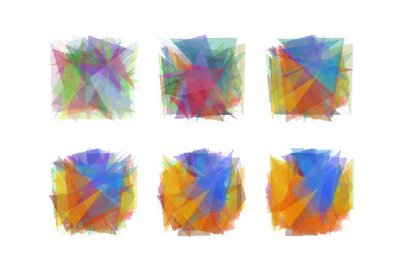

# Tiga

This is a true story.

Once upon a time there were a group of scallops on the coast that lived and prospered. They were naturally undressed and even the house was settled. There was only one thing they were worried about: Every once in a while, there was always someone to dig them. Part of it. Of course, I’m going to dig back and do what everyone knows. But what the scallops don’t know is that this family’s family totem is the icon of Firefox, so he always chooses the scallops that look less like the Firefox icon.

This situation has lasted for hundreds of thousands of generations. Everyone should have guessed what happened to the scallops: their shells are printed with patterns resembling Firefox icons.



# Usage

```sh
# Install the requirements
$ pip3 install numpy scikit-image

# Run with arguments [Control image path] [Output dir]
$ python3 tiga.py firefox.png /tmp/img
```

Wait a few hours, you will get 3000 images, each closer to the firefox icon.

# How does it works?

The principle is on my personal blog: [http://accu.cc/content/daze/ga/evolve/](http://accu.cc/content/daze/ga/evolve/). The article is in Chinese, and I am very sorry that there are no other languages available.

But simply put, I used Genetic-Algorithms.

# Why tiga?

Tiga means 3, Ti-(G)enetic-(A)lgorithms. Or: Ultraman Tiga!


# Licences

WTFPL
